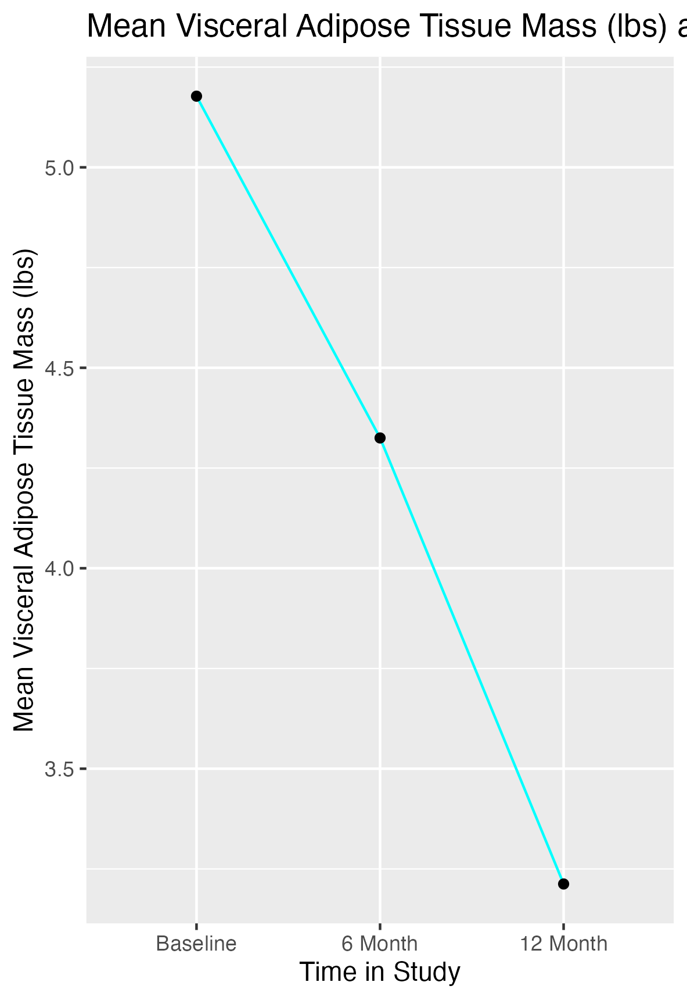
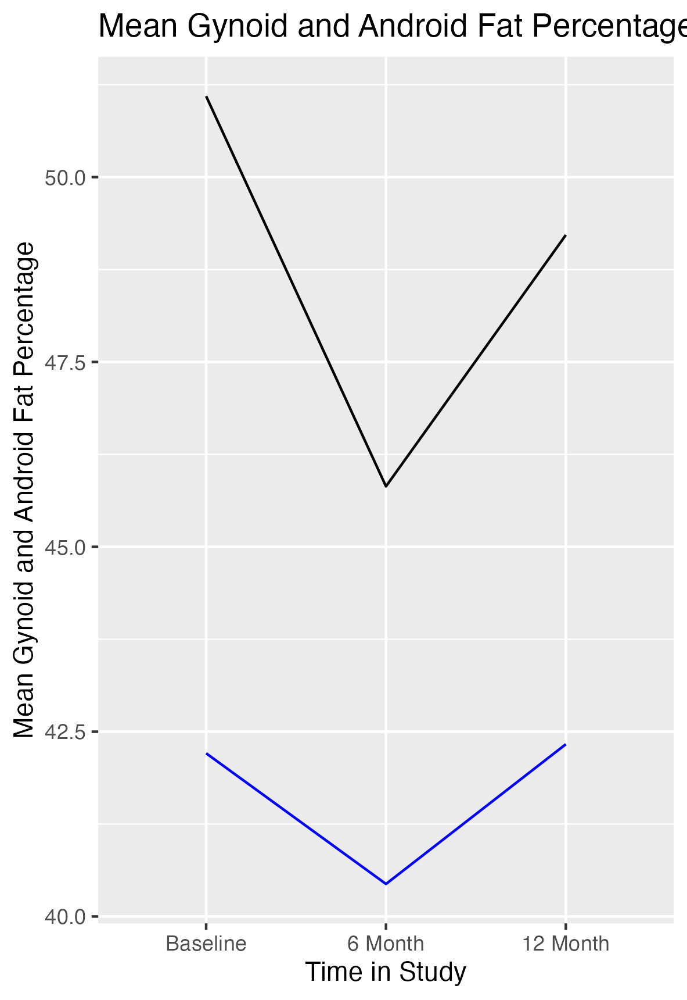

```{r, here, echo=FALSE}
here::i_am("dxafinalreport.rmd")
```

# **Introduction** 
This dataset contains DXA and physical activity questionnaire data. DXA data is body composition data. We will be analyzing central obesity measures (e.g. visceral adipose tissue mass, android fat percentage relative to gynoid fat percentage) with responses from a physical activity questionnaire, as well as the changes in central obesity trends over the study period of 1 year. 

The particular dataset you have been provided with is simulated data that is designed to be formatted similarly to what could be genuine measures of this data. Any measures that are similar to you or someone you may know is purely coincidental. 

We will be using primarily weekday physical activity data for increased generalizability. This physical activity data will be analyzed as Non-Exercise Activity Thermogenesis (NEAT) and as intentional physical activity. The primary variable for NEAT will be weekday, non-brisk walking, and the primary variable for intentional physical activity will be weekday weight training. The reasoning for this is non-brisk walking tends to be completed as a result of the environment in which one lives and works, as well it is a general lifestyle factor. Resistance/weight training tends to be an intentional form of exercise in that the choice to go to a location with resistance training materials is made in order to complete that activity. This analysis is relatively simple to generate basic information regarding these datasets. 

## **Analysis Objectives**
We will be conducting a relatively limited analysis on the DXA data. *The objectives of this report include*:

- Evaluate study-wide trends in central adiposity over the course of one calendar year, including changes in visceral adipose tissue mass, android fat percentage, and gynoid fat percentage.

- Investigate study-wide trends in both intentional physical activity(such as resistance training) and non-exercise activity thermogenesis (NEAT) and recognize the impact that may have on central adiposity.

- Quantify the study-wide difference between android and gynoid fat percentages.

```{r, clean-data, echo=FALSE}
library(readxl)
library(magrittr)
library(tidyverse)
library(knitr)
dxareport_raw <- read_excel("clean_simulated_data/dxa_simulation.xlsx")
dxareport <- janitor:: clean_names(dxareport_raw) %>% select(study_id,bl_age, bl_totalmass, bl_visceral_adipose_tissue_mass_lbs, bl_android_percent_fat, bl_gynoid_percent_fat, bl_sitting, bl_walking, bl_weighttraining, x6mo_total_mass_lbs, x6mo_visceral_adipose_tissue_mass_lbs, x6mo_gynoid_percent_fat, x6mo_android_percent_fat,  x6mo_walking_including_treadmill_less_than_3_mph_or_slower_than_20_minutes_per_mile, x6mo_weight_training, x12mo_visceral_adipose_tissue_mass_lbs, x12mo_walking, x12mo_weighttraining, x12mo_total_mass_lbs, x12mo_visceral_adipose_tissue_mass_lbs, x12mo_android_percent_fat, x12mo_gynoid_percent_fat)

```

# **Baseline Characteristics**
The table below describes the age, physical activity level, and weight measures of participants at baseline. We generated these particular measures to conceptualize the baseline characteristics of participants. This table contains demographic information, body composition information and physical activity information, chosen on ability to develop a comprehensive idea of habits regarding exercise and non-exercise physical activity and central adiposity measures at baseline.
```{r, create-table-1}
table_one <- readRDS("output/table_one.rds"
)
table_one
```


# **Trends over the Study Period**
The graphs below depict the changes in centralized adiposity measures over the year they participated in the study. The first graph is aiming to visualize the change in visceral adipose tissue mass in pounds and the second graph is aiming to do the same with both android and gynoid fat percentage data. Android and gynoid adipose tissue percent are central obesity measures that refer to the physical location of adipose tissue. 

```{r, create-figures}



```